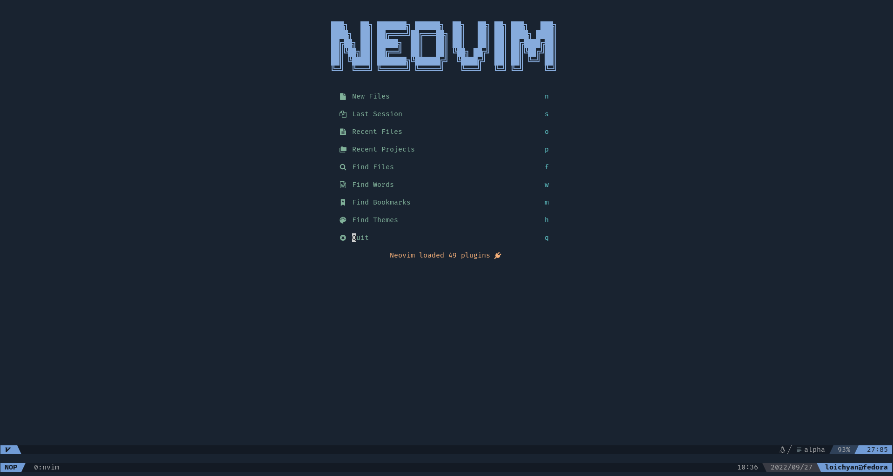

# 🌱 MiNV

Extendable lightweight Neovim configuration framework written in TypeScript.

## 📌 Notice

This project is **no longer maintained**, please use
[DeltaVim](https://github.com/loichyan/DeltaVim) instead.

## 📝 Todo

- [x] Rewritten in TypeScript
- [ ] Extendable layers
- [ ] Core layer
- [ ] More layers

## ⚖️ License

This software is released under the either of [MIT License](LICENSE-MIT) or
[Apache License 2.0](LICENSE-APACHE) at your option.
